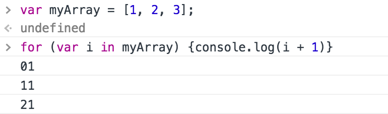
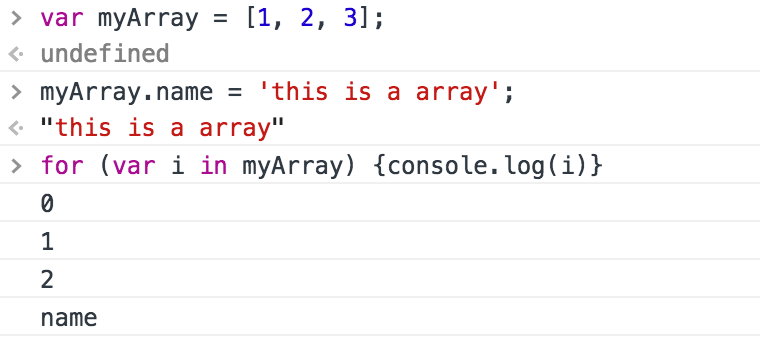

# 迭代器和 for-of 循环 #
> 原文出处：http://www.kancloud.cn/kancloud/es6-in-depth/45514

## 主要内容 ##
> #### 强大的 for-of 循环 ####
> #### for-of 循环遍历其它的集合 ####

## 正文 ##
### 1. 强大的 for-of 循环 ###

我们如何遍历数组中的元素？最原始的实现数组遍历的方式：  

	for (var i = 0; i < myArray.length; i++) {
	  console.log(myArray[i]);
	}

自ES5正式发布后，我们可以使用内建的 forEach 方法来遍历数组：  

	myArray.forEach(function(value){
	  console.log(value);
	});

这段代码看起来更加简洁，但这种方法也有一个小缺陷：你不能使用break语句中断循环，也不能使用return语句返回到外层函数。  

我们也可以使用 for-in 循环来遍历数组：  

	for (var i in myArray) {
	  console.log(i);
	}

但是可能存在一些问题：  
+ 在这段代码中，赋给 i 的值不是实际的数字，而是字符串“0”、“1”、“2”...这样在进行字符串计算的时候就会带来不便，例如：

+ for-in 循环体除了遍历数组元素外，还会遍历自定义属性，例如：

因此，标准委员会在ES6中增加了一种新的循环语法来解决目前的问题.如下：  

	for (var value of myArray) {
	  console.log(value);
	}

+ 这是最简洁、最直接的遍历数组元素的语法
+ 这个方法避开了for-in循环的所有缺陷
+ 与 forEach() 不同的是，它可以正确响应 break、continue 和 return 语句

